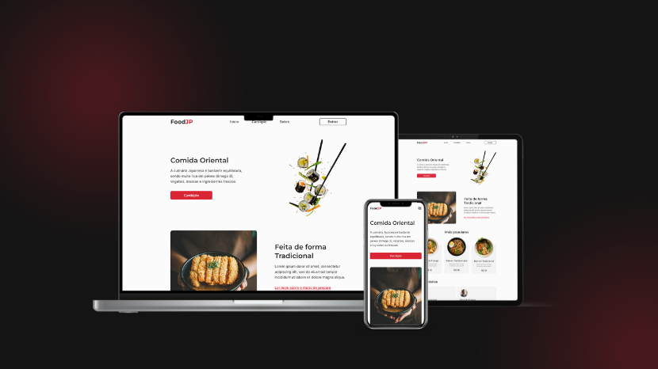

<p align="center">
  
</p>

<p align="center">
  

  

  
</p>

<h1 align="center">
    <!--  -->
</h1>

<br>

## 🧪 Technologies

This project was developed using the following technologies:

- [ReactJS](https://reactjs.org/)
- [Styled Components](https://styled-components.com/)

## 🚀 Getting started

Clone the project and access the folder.

```bash
git clone https://github.com/Robson-Carvalho/foodjp.git

cd foodjp
```

Run this command to install the dependencies.

```bash
npm install

npm run dev
```

## 🔖 Layout

You can view the project through the links below:

- [Live Preview](https://foodjp-robson-carvalho.vercel.app/)

- [Figma](https://www.figma.com/file/Yb9IBH56g7T1hdIyZ3BMNO/Desafios---Codel%C3%A2ndia?node-id=107523%3A1216&t=vXWq2FBegTf9ls0z-0)

Remembering that you need to have a [Figma](http://figma.com/) account to access it.

## 📝 License

This project is licensed under the MIT License. See the [LICENSE](./LICENSE.md) file for details.

---

Made with 💜 by [Robson Carvalho](https://portfolio-robson-carvalho.vercel.app/) 👋
